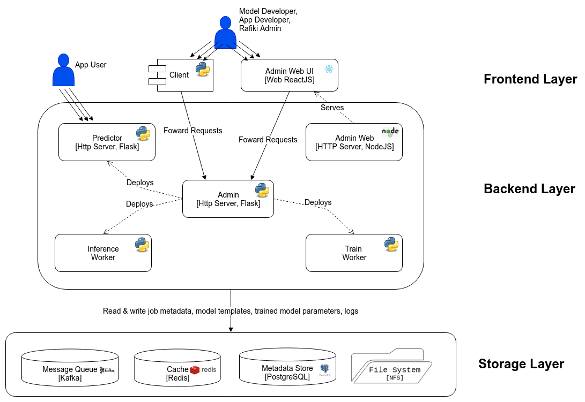

.. _`architecture`:

SINGA-Auto's Architecture
====================================================================

SINGA-Auto’s system architecture consists of 3 static components, 2 central databases, 4 types of dynamic components, and 1 client-side SDK,
which can be illustrated with a 3-layer architecture diagram.

    Architecture of SINGA-Auto

Static Stack of SINGA-Auto
---------------------------------------------------------------------

SINGA-Auto’s static stack consists of the following:

    *SINGA-Auto Admin* (*Python/Flask*) is the centrepiece of SINGA-Auto. It is a multi-threaded HTTP server which presents a unified REST API over HTTP that fully administrates the Singa-Auto instance. When users send requests to Singa-Auto Admin, it handles these requests by accordingly modifying Singa-Auto’s Metadata Store or deploying/stopping the dynamic components of Singa-Auto’s stack (i.e. workers for model training & serving).

    *SINGA-Auto Metadata Store* (*PostgreSQL*) is SINGA-Auto’s centralized, persistent database for user metadata, job metadata, worker metadata and model templates.

    *SINGA-Auto Redis* (*Redis*) is SINGA-Auto’s temporary in-memory store for the implementation of fast asynchronous cross-worker communication, in a way that decouples senders from receivers. It synchronizes the back-and-forth of queries & predictions between multiple Singa-Auto Inference Workers and a single Singa-Auto Predictor for an Inference Job.

    *Singa-Auto Web Admin* (*NodeJS/ExpressJS*) is a HTTP server that serves Singa-Auto’s web front-end to users, allowing Application Developers to survey their jobs on a friendly web GUI.

    *Singa-Auto Client* (*Python*) is Singa-Auto’s client-side Python SDK to simplify communication with Admin.

Dynamic Stack of Singa-Auto
---------------------------------------------------------------------

On the other hand, Singa-Auto’s dynamic stack consists of a dynamic pool of workers.
Internally within Singa-Auto’s architecture, Admin adopts master-slave relationships with these workers, managing the deployment and termination of these workers in real-time depending on Train Job and Inference Job requests, as well as the stream of events it receives from its workers.
When a worker is deployed, it is configured with the identifier for an associated job, and once it starts running, it would first initialize itself by pulling the job’s metadata from Metadata Store before starting on its task.

The types of workers are as follows:

    *Singa-Auto Advisor Workers* (*Python*) proposes knobs & training configuration for Train Workers. For each model, there is a single Advisor Worker centrally orchestrating tuning of the model together with multiple Train Workers.

    *Singa-Auto Train Workers* (*Python*) train models for Train Jobs by conducting Trials.

    *Singa-Auto Predictors* (*Python/Flask*) are multi-threaded HTTP servers that receive queries from Application Users and respond with predictions as part of an Inference Job. It does this through  producer-consumer relationships with multiple Singa-Auto Inference Workers. If necessary, it performs model ensembling on predictions received from different workers.

    *Singa-Auto Inference Workers* (*Python*) serve models for Inference Jobs. In a single Inference Job, there could be multiple Inference Workers concurrently making predictions for a single batch of queries.

Container Orchestration Strategy
---------------------------------------------------------------------

All of Singa-Auto's components' environment and configuration has been fully specified as a replicable, portable Docker image publicly available as Dockerfiles and on `Singa-Auto’s own Docker Hub account <https://hub.docker.com/u/rafikiai>`__.

When an instance of Singa-Auto is deployed on the master node, a `Docker Swarm <https://docs.docker.com/engine/swarm/key-concepts/>`__ is initialized and all of Singa-Auto's components run within a single `Docker routing-mesh overlay network <https://docs.docker.com/network/overlay/>`__.
Subsequently, Singa-Auto can be horizontally scaled by adding more worker nodes to the Docker Swarm. Dynamically-deployed workers run as `Docker Swarm Services <https://docs.docker.com/engine/swarm/services/>`__
and are placed in a resource-aware manner.

Distributed File System Strategy
---------------------------------------------------------------------
All components depend on a shared file system across multiple nodes, powered by *Network File System* (*NFS*).
Each component written in Python continually writes logs to this shared file system.
